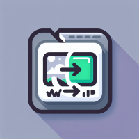

# webp-bot


Discord bot to convert JPG, PNG, GIF into WEBP

# Installation

### 1. Install requirements
``` python
$ uv sync
```

### 2. Setup environments
``` shell
$ echo BOT_TOKEN="YOUR_DISCORD_BOT_TOKEN" > .env
```

### 3. Run bot
``` shell
python main.py
```
